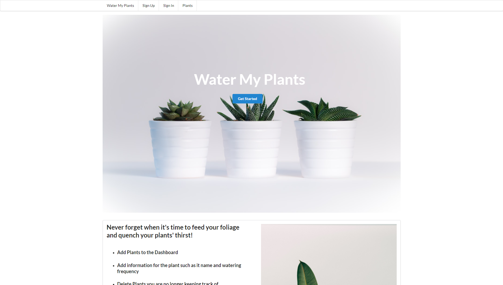

<h1 align="center">
  Water My Plants
</h1>
<p align="center">
  A Lambda School "Build Week" collab project where contributors built a fullstack CRUD application in just a (work) weeks time.  
</p>
<p align="center">
  Within the Web app you can: 
  <ul>
    <li><b>Authorization & Authentication: </b>Sign in or Sign Out</li>
    <li><b>Create: </b>Create new plant card</li>
    <li><b>Read: </b>Get a list of the current plants available on the dashboard</li>
    <li><b>Update: </b>Update a plant card's information</li>
    <li><b>Delete: </b>Delete cards that YOU create</li>
  </ul>
</p>



## 🚨 Forking this repo (please read!)


## 🛠 Installation & Set Up


1. Install and use the correct version of Node using [NVM](https://github.com/nvm-sh/nvm)

   ```sh
   nvm install
   ```

2. Install dependencies

   ```sh
   yarn
   ```

3. Start the development server

   ```sh
   npm start
   ```

## 🚀 Building and Running for Production

1. Generate a full static production build

   ```sh
   npm run build
   ```

2. Preview the site as it will appear once deployed

   ```sh
   npm run start
